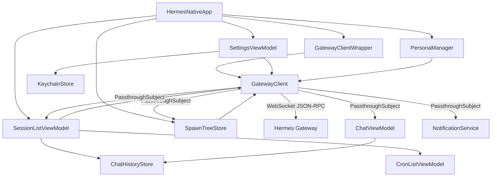

# Hermes Native

Native macOS + iOS client for [Hermes Agent](https://github.com/nousresearch/hermes-agent) — built with Swift + SwiftUI.

Connects directly to a Hermes Gateway via WebSocket JSON-RPC (`/v1/ws`), giving you full TUI parity from a native app. No local server, no CLI, no Node.js.

## Features

- **WebSocket JSON-RPC** — 50+ gateway methods: sessions, prompts, approvals, config, skills, cron, delegation
- **Streaming chat** — real-time `message.delta` / `tool.start` / `tool.complete` events
- **Chat skins** — pluggable renderers: TUI, Dark Manga, with custom skin API (`ChatSkinProviding`)
- **Mermaid diagrams** — inline Mermaid rendering via WKWebView
- **Spawn tree** — live subagent/delegation hierarchy visualization (Mission Control)
- **Cron dashboard** — view, pause, resume, remove scheduled jobs
- **Persona system** — load personas from gateway + local JSON + built-in presets
- **3D avatar** — Lottie + SceneKit character with state-driven expressions
- **Cloudflare Access** — built-in CF Access auth flow for enterprise gateways
- **Cross-platform** — macOS 14+ and iOS 17+ from a single codebase
- **macOS Keychain** — API key + gateway URL stored securely via Security framework
- **Zero dependencies** — pure Swift, SwiftUI, URLSession + URLSessionWebSocketTask
- **Swift 6 strict concurrency** — no data races, no `@Sendable` gymnastics

## Requirements

- macOS 14 (Sonoma) / iOS 17 or later
- Xcode 16+ / Swift 6+
- A running Hermes Gateway with API server enabled (`api_server` platform)

## Build

```bash
git clone https://github.com/researchoors/hermes-native.git
cd hermes-native
swift build
```

## Run

```bash
swift run
```

Or open `Package.swift` in Xcode and hit ▶.

## Configuration

On first launch, enter your gateway URL and API key:

| Field | Example |
|-------|---------|
| Gateway URL | `wss://your-gateway.example.com/v1/ws` |
| API Key | Bearer token from `API_SERVER_KEY` |

The app converts `https://` → `wss://` and appends `/v1/ws` automatically. Production gateway URL can be overridden via the `HERMES_GATEWAY_URL` environment variable.

## Architecture



### Models

| Model | Description |
|-------|-------------|
| `GatewayEvent` | Central event enum — all WebSocket events parsed into typed cases with associated payloads (~15 payload types) |
| `ChatMessage` | Message + tool call structs, file attachments, media parser |
| `Session` | Session metadata with status enum (active/idle/archived) |
| `CronJob` | Scheduled job model |
| `Persona` | Persona identity with accessories and theming |
| `SpawnNode` | Recursive tree node for subagent/delegation hierarchy (`ObservableObject`) |
| `JSONRPCRequest/Response` | JSON-RPC 2.0 framing with `AnyCodable` type-erased params |

### Services

| Service | Description |
|---------|-------------|
| `GatewayClient` | Core networking — WebSocket JSON-RPC, auto-reconnect, ping/pong keepalive, all RPC methods |
| `GatewayClientWrapper` | Observable lifecycle wrapper — manages connection using `SettingsViewModel` |
| `ChatHistoryStore` | Persists `[ChatMessage]` per session to disk (`Application Support/hermes-native/sessions/`) |
| `KeychainStore` | macOS/iOS Keychain CRUD for API key and gateway URL |
| `NotificationService` | Push notifications for tool approvals and subagent events |

### ViewModels

| ViewModel | Description |
|-----------|-------------|
| `ChatViewModel` | Message state, streaming, tool calls, approvals, avatar state. Subscribes to `GatewayClient.eventStream` |
| `SessionListViewModel` | Session CRUD, ID mapping, local title persistence |
| `CronListViewModel` | Cron job list management via gateway RPCs |
| `SettingsViewModel` | Gateway URL, API key, CF Access auth detection |
| `PersonaManager` | Persona loading (gateway + local JSON + built-in), persistence |
| `SpawnTreeStore` | Accumulates subagent events into live `SpawnNode` trees per session |

### Views

| View | Description |
|------|-------------|
| `ContentView` | Root — sidebar navigation, environment object wiring |
| `ChatView` | Main chat interface with skin picker, input bar, debug log |
| `MessageBubbleView` | Per-message rendering with reasoning blocks and tool calls |
| `ToolTrailView` / `ToolCallView` | Tool call visualization with tree branching |
| `MarkdownContentView` | Custom Markdown renderer with Mermaid, tables, inline HTML |
| `MermaidDiagramView` | Mermaid diagram rendering via WKWebView |
| `SessionListView` | Session list with status indicators and context menus |
| `CronListView` | Cron job management UI |
| `SettingsView` / `OnboardingView` | Configuration and first-launch setup |
| `CFAuthView` | Cloudflare Access authentication web view |
| `Avatar3DView` / `LottieCharacterView` | 3D and Lottie character animations |
| `PersonaPickerView` | Persona selection UI |

**Mission Control** (`Views/MissionControl/`):
- `SessionExplorerView` — explore a session's spawn tree (tree/transcript/details tabs)
- `SessionObserverView` — observe running sessions with live events
- `TreeNodeView` — recursive tree node rendering

**Chat Skins** (`Views/Skins/`):
- `ChatSkin` enum + `ChatSkinProviding` protocol — pluggable skin system
- `TUISkin` — terminal-style renderer
- `DarkMangaSkin` — dark manga-themed renderer with custom bubbles and indicators

## Wire Protocol

Same as the TUI gateway — newline-delimited JSON-RPC 2.0 over WebSocket:

```jsonc
→ {"jsonrpc":"2.0","id":1,"method":"session.create","params":{"cols":120}}
← {"jsonrpc":"2.0","id":1,"result":{"session_id":"abc123"}}

← {"jsonrpc":"2.0","method":"message.delta","params":{"text":"Hello"}}
← {"jsonrpc":"2.0","method":"tool.start","params":{"tool":"terminal","input":"ls"}}
```

## License

MIT
