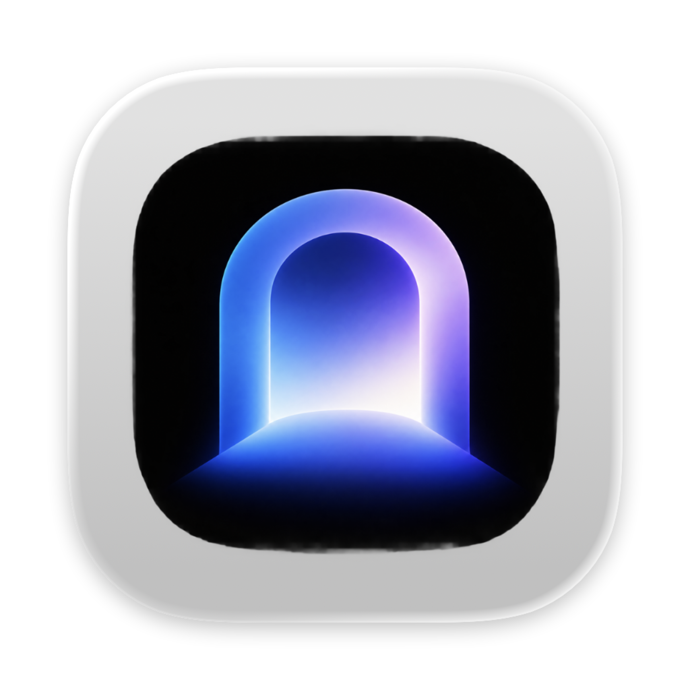
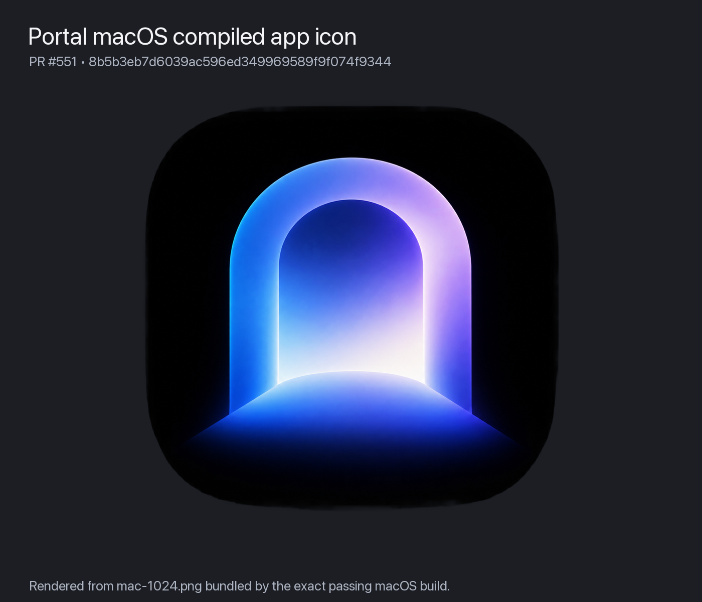
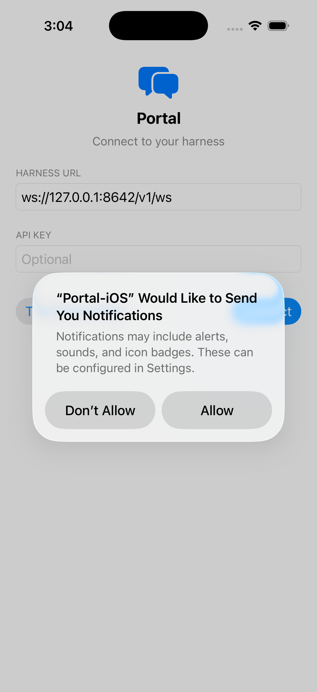
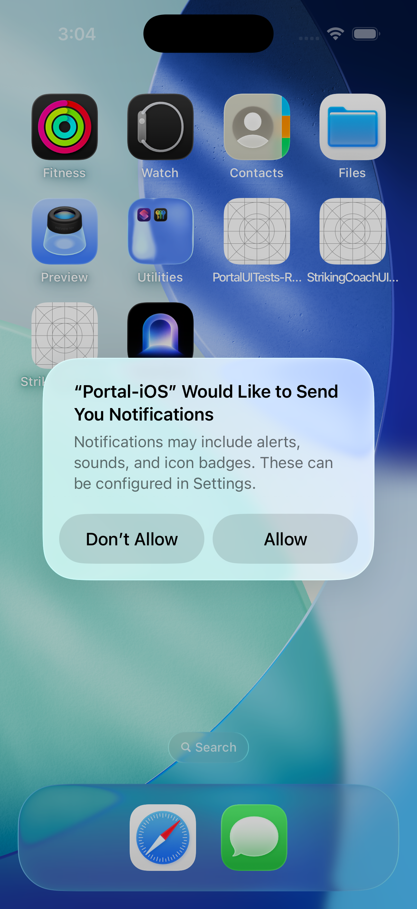

# PR #551 validation evidence

- Issue: https://github.com/ethenotethan/portal/issues/547
- Pull request: https://github.com/ethenotethan/portal/pull/551
- Immutable reviewed head: `8b5b3eb7d6039ac596ed349969589f9f074f9344`
- Validation host: macOS 26.5.2 (Apple Silicon)
- Result: **INTERACTIVE PASS; final lifecycle transition pending terminal CI**

## Expected result

The installed macOS and iOS application icon should use the approved issue #547 blue/purple illuminated portal artwork. The macOS asset must retain transparency; iOS icon files must be opaque RGB. The exact PR revision must build and launch on the reported macOS target, and the arm64 iOS Simulator target must install and launch.

## Procedure and observed result

1. Checked out the PR head detached and verified both local `HEAD` and GitHub's live `headRefOid` equal the immutable SHA above.
2. Ran `swift test --disable-sandbox --filter AppIconAssetTests`: **PASS** (the named icon test executed).
3. Ran `swiftlint lint --strict Tests/PortalTests/AppIconAssetTests.swift`: **PASS**, zero violations.
4. Ran the repository-defined macOS `make run` path, then relaunched the exact built executable with `-ApplePersistenceIgnoreState YES`. The running process path was the PR build under DerivedData and its bundle id was `com.ethenotethan.Portal.macOS`.
5. Extracted `NSRunningApplication.icon` from that exact live process (PID observed at capture time) and encoded it to `macos-running-app-icon.png`. The runtime icon is the approved blue/purple portal artwork in the normal macOS icon plate; no visible clipping, substitution, or stale chat-bubble artwork was observed.
6. Built `Portal-iOS` for the arm64 iPhone 17 Pro simulator with `xcodebuild ... ARCHS=arm64 ONLY_ACTIVE_ARCH=YES build`: **BUILD SUCCEEDED**.
7. Installed and launched bundle `com.ethenotethan.Portal.iOS` with `simctl`. `ios-app-running.png` shows the exact built application at its connection screen. The system notification-consent sheet was left untouched. After returning to SpringBoard, `ios-home-icon.png` shows the installed blue/purple portal icon.
8. Independent read-only review at the same SHA returned **CLEAN**: exactly 18 catalog-referenced PNG replacements plus `AppIconAssetTests.swift`, no unintended tracked scope; all 7 macOS assets are exact resizes of the issue source; all 11 iOS assets are exact opaque black-composited resizes; the test meaningfully checks catalog membership, dimensions, alpha policy, and canonical pixel identity.

## Runtime evidence

### macOS icon from the exact running process

### macOS compiled source render

### iOS app launched from the exact simulator build

### iOS installed home-screen icon

## Evidence hashes (SHA-256)

- `macos-running-app-icon.png`: `fc26701dd50c6094da5703c9f26ad88e5e0a3f03324fc71b33f3da108dbd84a6`
- `macos-compiled-icon-render.png`: `0e85156f7d8158026d1931d4f68ffdce66c26463ffac1244ff6bf4ce4a32c0b0`
- `ios-app-running.png`: `fbe9eea9641617e4665ea1b08e8fc65989a7b3588c53611a5b6056bf1521bc78`
- `ios-home-icon.png`: `1cdb411501dc6652400fb7964d9d6ebe01b1b922ab4e63eea67673b3333df996`

## CUA capture note

`computer_use`/cua-driver was exercised against the live Portal and Simulator processes. The driver enumerated the iPhone 17 Pro window, but its window capture returned `px_capture_unavailable` / `screencapture failed ... could not create image from window`; wrapper captures were `0x0`. The read-only doctor reported Accessibility and Screen Recording grants present. No permission dialog was clicked. To preserve exact-target evidence without modifying the PR, simulator-native PNG capture and `NSRunningApplication.icon` extraction were used as the fallback. This is an evidence-tool limitation, not an observed product failure.

## CI

At the final read-back captured for this evidence commit, 11 checks had passed:

- Build: `build`
- Tests: `Swift package tests`, `iOS simulator smoke tests`, `macOS main-thread hang gate`
- Lint and ratchets: `SwiftLint`, `Quality`, `Security`, `Skipped Tests`, `Measure (build + test)`, `Coverage`, `Warnings`

The `Dead Code` and `Performance` jobs in Ratchet run
[`35772570302`](https://github.com/ethenotethan/portal/actions/runs/35772570302)
remained queued with no runner start or terminal conclusion. Therefore this evidence records a
successful exact-revision application validation, but does not claim terminal CI or
`state:merge-ready` eligibility.
